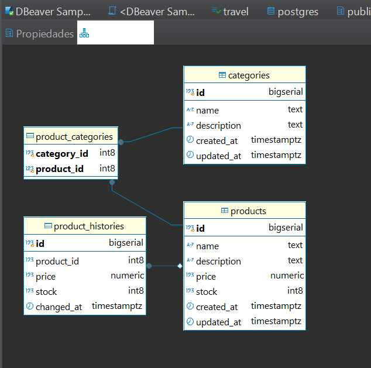

# Qisur Challenge - API REST y WebSocket para Gestión de Productos

Este proyecto es una API RESTful y un sistema de WebSockets desarrollado en Go para la gestión de productos y categorías, siguiendo con los requerimientos de Qisur Challenge. Se utiliza PostgreSQL como base de datos, JWT para la autenticación y GORM como ORM.

## Índice

- [Objetivo](#objetivo)
- [Requerimientos Técnicos](#requerimientos-técnicos)
- [Estructura del Proyecto](#estructura-del-proyecto)
- [Instalación y Configuración](#instalación-y-configuración)
- [Listado de Apis](#listado-de-apis)
- [Colección de Postman](#colección-de-postman)
- [WebSockets](#websockets)
- [Configuración de PostgreSQL](#configuración-de-postgresql)
- [Diagrama ERD de BD](#diagrama-de-bd)

## Objetivo

El objetivo es crear una API RESTful y un sistema de comunicación en tiempo real mediante WebSockets para la gestión de productos y categorías. El proyecto debe demostrar buenas prácticas en el desarrollo backend, manejo de datos en tiempo real y seguridad a través de autenticación JWT.

## Requerimientos Técnicos

- **Lenguaje:** Go (Golang)
- **Base de Datos:** PostgreSQL
- **Librerías:**
  - [Gorilla Mux](https://github.com/gorilla/mux) (enrutamiento)
  - [Gorilla WebSocket](https://github.com/gorilla/websocket) (WebSockets)
  - [GORM](https://gorm.io/) (ORM para PostgreSQL)
  - [golang-jwt/jwt](https://github.com/golang-jwt/jwt) (Autenticación JWT)
  - [godotenv](https://github.com/joho/godotenv) (Carga de variables de entorno)

## Estructura del Proyecto

El proyecto está organizado de la siguiente manera:

```sh
qisur-challenge/
├── main.go
├── config/
│   ├── config.go
│   └── database.go
├── controllers/
│   ├── auth_controller.go
│   ├── category_controller.go
│   └── product_controller.go
├── middlewares/
│   └── auth_middleware.go
├── models/
│   ├── category.go
│   ├── product.go
│   └── product_history.go
├── repository/
│   ├── category_repository.go
│   └── product_repository.go
├── routes/
│   ├── routes.go
│   ├── categories.routes.go
│   └── product.routes.go
├── services/
│   ├── category_service.go
│   └── product_service.go
├── webSocket/
│   └── websocket.go
├── .env.example
├── README.md
└── go.mod
```

## Instalación y Configuración

### Requisitos

+ Go (versión 1.18 o superior)
+ PostgreSQL

### Pasos de Instalación

1. **Clonar el repositorio:**

```sh
git clone https://github.com/tu_usuario/Qisur_challenge
cd qisur-challenge
```

2. **Configurar Variables de Entorno:**

 + Copiar el archivo .env.example y renombrar a .env.
 + Editar el archivo .env para configurar:

```sh
DB_HOST=localhost
DB_USER=postgres
DB_PASSWORD=yourpassword
DB_NAME=qisur_challenge
DB_PORT=5432
SERVER_PORT=8080
JWT_SECRET=secret_key
```

3. **Instalar Dependencias:**

 + Ejecutar en la raíz del proyecto:

```sh
go mod tidy
```

 + Ejecutar la Aplicación:

 + Desde la carpeta raíz:

```sh
go run main.go
```

 + Vas a ver en la consola mensajes como:

```sh
Conexión a la base de datos exitosa
Migraciones completadas.
Servidor iniciado en el puerto 8080
``` 

## **Listado de Apis**
## 🔐 Token de Autenticación

#### POST /api/login 
Obtiene token para acceder a los endpoints protegidos.

**Request Body:**
```json
{
   "username": "admin",
   "password": "admin"
}
```

**Response Body:**
```json
{
   "token": "eyJhbGciOiJIUzI1NiIsInR5cCI6IkpXVCJ9..."
}
```

#### GET /api/products
Listar Productos

**Response Body:**
```json
[
    {
        "id": 1,
        "name": "PC",
        "description": "Lenovo, Thinkpad, 16GB",
        "price": 1500.99,
        "stock": 10,
        "created_at": "0000-12-31T21:00:00-03:00",
        "updated_at": "2025-05-10T15:06:40.286152-03:00",
        "categories": [
            {
                "id": 1,
                "name": "Electrónica"
            }
        ]
    }
]
```
#### GET /api/products/{id}
Obtiene un producto por numero de id

**Headers:**  
`Content-Type: application/json`  
`Authorization: Bearer <token>`

**Response Body:**
```json
{
    "id": 1,
    "name": "PC",
    "description": "Lenovo, Thinkpad, 16GB",
    "price": 1500.99,
    "stock": 10,
    "created_at": "0000-12-31T21:00:00-03:00",
    "updated_at": "2025-05-10T15:06:40.286152-03:00",
    "categories": [
        {
            "id": 1,
            "name": "Electrónica"
        }
    ]
}
```

#### POST /api/products
Crea un nuevo producto

**Headers:**  
`Content-Type: application/json`  
`Authorization: Bearer <token>`

**Request Body:**
```json
{
  "name": "Smartphone",
  "description": "Samsung Galaxy S21, 128GB, 8GB RAM",
  "price": 899.99,
  "stock": 25
}
```

**Response Body:**
```json
{
    "id": 2,
    "name": "Smartphone",
    "description": "Samsung Galaxy S21, 128GB, 8GB RAM",
    "price": 899.99,
    "stock": 25,
    "created_at": "2025-05-10T21:28:07.1413082-03:00",
    "updated_at": "2025-05-10T21:28:07.1413082-03:00",
    "categories": null
}
```

#### PUT /api/products/{id}
Actualizamos un producto por su id , se actualizaran los datos de los campos que se pasen

**Headers:**  
`Content-Type: application/json`  
`Authorization: Bearer <token>`

**Request Body:**
```json
{
    "name": "Smartphone",
    "description": "Samsung Galaxy S21, 128GB, 8GB RAM",
    "price": 899.99,
    "stock": 25,
    "categories": [1]
}
```

**Response Body:**
```json
{
    "id": 3,
    "name": "Smartphone",
    "description": "Samsung Galaxy S21, 128GB, 8GB RAM",
    "price": 899.99,
    "stock": 25,
    "created_at": "2025-05-10T22:31:00.742587-03:00",
    "updated_at": "2025-05-10T22:32:39.4288154-03:00",
    "categories": [
        {
            "id": 1,
            "name": "Electrónica"
        }
    ]
}
```

#### DELETE /api/products/{id}
Elimina un producto por su id

**Headers:**  
`Content-Type: application/json`  
`Authorization: Bearer <token>`

**Response:**
```
status:204
```

#### GET /api/categories
Lista las categorias

**Response Body:**
```json
[
    {
        "id": 2,
        "name": "Tecnologia",
        "description": "Productos con alimentacion electrica",
        "products": [
            {
                "id": 3,
                "name": "Smartphone"
            }
        ]
    }
]
```
#### GET /api/categories/{id}
Obtiene el detalle de una categoria

**Headers:**  
`Content-Type: application/json`  
`Authorization: Bearer <token>`

**Response Body:**
```json
{
    "id": 1,
    "name": "Tecnologia",
    "description": "Productos electronicos de ultima generacion",
    "products": [
        {
            "id": 3,
            "name": "Smartphone"
        }
    ]
}
```

#### Put /api/categories/{id}
Actualiza los datos de una categoria

**Headers:**  
`Content-Type: application/json`  
`Authorization: Bearer <token>`


**Request Body:**
```json
{
  "name": "Tecnologia",
  "description": "Productos electronicos de ultima generacion"
}
```

**Response Body:**
```json
{
    "id": 1,
    "name": "Tecnologia",
    "description": "Productos electronicos de ultima generacion",
    "products": [
        {
            "id": 3,
            "name": "Smartphone"
        }
    ]
}
```

#### DELETE /api/categories/{id}
Elimina una categoria por su id

**Headers:**  
`Content-Type: application/json`  
`Authorization: Bearer <token>`

**Response:**
```
status:204
```


#### POST /api/categories
Crea una nueva categoria

**Headers:**  
`Content-Type: application/json`  
`Authorization: Bearer <token>`

**Request Body:**
```json
{
    "name": "Tecnologia",
    "description": "Productos con alimentacion electrica"
}
```

**Response Body:**
```json
{
    "id": 2,
    "name": "Tecnologia",
    "description": "Productos con alimentacion electrica",
    "created_at": "2025-05-11T13:30:13.5432427-03:00",
    "updated_at": "2025-05-11T13:30:13.5432427-03:00",
    "products": null
}
```

#### GET /api/products/{id}/history?start=2025-02-02&end=2025-06-22
Lista el historial de un producto

**Headers:**  
`Content-Type: application/json`  
`Authorization: Bearer <token>`

**Response Body:**
```json
[
    {
        "id": 1,
        "product_id": 3,
        "price": 899.99,
        "stock": 25,
        "changed_at": "2025-05-11T12:32:06.811553-03:00"
    },
]
```

#### GET /api/search?type=product&name=celular&sort=price_asc&page=1&limit=10
Realiza una busque por filtros pasados por parametro
type = product | category
ejemplos:
-/api/search?type=product&id=3&limit=5
-/api/search?type=category&name=tecnologia&limit=3

**Response Body:**
```json
[
    {
        "id": 2,
        "name": "Tecnologia",
        "description": "Productos con alimentacion electrica",
        "created_at": "2025-05-11T13:30:13.543242-03:00",
        "updated_at": "2025-05-11T13:30:13.543242-03:00",
        "products": null
    }
]
```

## Colección de Postman

Para facilitar las pruebas de las APIs, se incluye una colección de Postman:  
[`qisur-challenge.postman_collection.json`](./qisur-challenge.postman_collection.json)

Podés importarla en Postman para visualizar y ejecutar todas las solicitudes organizadas.


## **WebSockets**
####  ws://localhost:8080/ws
 + Postman: Crea una WebSocket Request.
Al crear, actualizar o eliminar productos/categorías, el servidor emitirá eventos en tiempo real, por 

```json
{
    "type": "product_delete",
    "content": "Producto con ID: 7 ha sido eliminado ."
}
```

## Configuración de PostgreSQL
 + Para ejecutar la aplicación, es necesario tener PostgreSQL instalado y configurado correctamente. Seguir estos pasos:

### Instalación de PostgreSQL:

 + Descargar e instalar PostgreSQL desde la página oficial según tu sistema operativo.

### Crear la Base de Datos:

 + Abrir el SQL Shell (psql) o usar una herramienta gráfica como pgAdmin.
 + Conectar al servidor (por defecto, localhost en el puerto 5432).
 + Ejecutar el siguiente comando para crear la base de datos:

```sh
    CREATE DATABASE qisur_challenge;
```

 + Para verificar, usar:

```sh
    \l # verificar que este la base de datos qisur_challenge.
```

 + Configurar las Variables de Entorno:

 + En el archivo .env del proyecto, actualiza los valores para conectar con PostgreSQL:

```sh
SERVER_PORT=8080
JWT_SECRET=secret_key
DB_HOST=localhost
DB_USER=postgres
DB_PASSWORD=admin1
DB_NAME=qisur_challenge
DB_PORT=5432
```

## Diagrama ERD de BD

